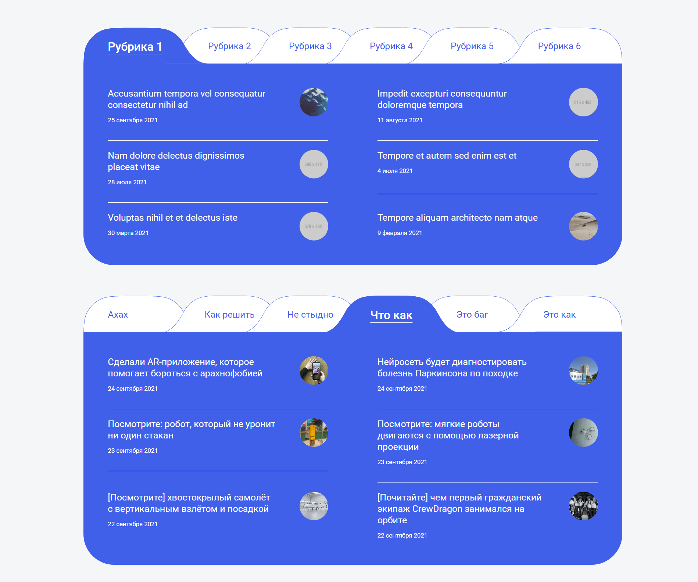

# Палиндром - Junior-фронтендер

## Задание

1) Сверстать блок (при нажатии на вкладку рубрики - выводятся посты из этой рубрики, а вкладка становится активной).
2) Создать тему WordPress.
3) На главной странице вывести посты и рубрики WordPress в сверстанный блок используя два метода  
    - Стандартный цикл Wordpress (WP_Query, get_posts и т.д)  
    - Wordpress REST API (посты и рубрики взять с сайта https://thecode.media)

    Отобразить на главной странице оба блока.

4) Скинуть архив созданной темы WordPress.

## Примечания по заданию
1) Верстать не обязательно pixel perfect (но табы должны быть сделаны с использованием svg из макета).
2) Для первого блока картинки и текст можно использовать свои (можно заполнить посты и рубрики с помощью плагина FakerPress или вручную).

## Ресурсы
- [Дизайн в Figma](https://www.figma.com/file/UenUa0qzXrbq1sba5CKtGv/Блок-со-статьями?node-id=0%3A1)
